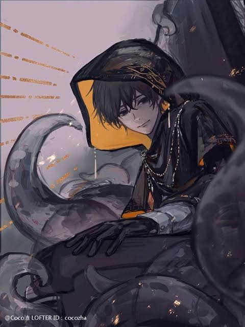
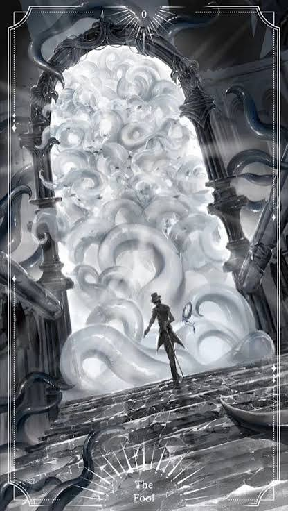
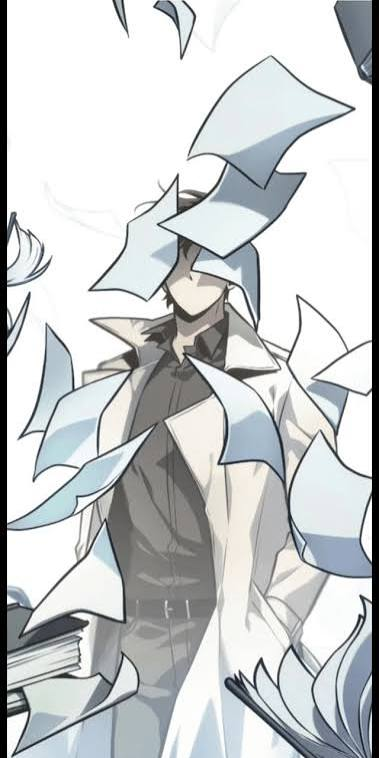

<p align="center">
  
</p>

<h1 align="center">ParadoxGPT</h1>

<p align="center">
  <em>Crafted from silence and sunless skies.</em>
</p>

<p align="center">
  
  
  
  
</p>

<p align="center">
  Personality-driven WhatsApp bot · Web pairing codes · Modular commands · Gothic menu
</p>

---

## Overview

ParadoxGPT is a rebuilt, production-minded WhatsApp bot:

| Feature | Detail |
|--------|--------|
| **Pairing** | Web dashboard pairing codes (no QR required) |
| **AI** | OmegaTech Qwen primary → GPT-4-mini fallback |
| **Commands** | Category folders: `ai` `anti` `auto` `general` `group` `media` `owner` `tools` |
| **Menu** | Image carousel, gothic footer, editable bio / handles / channel |
| **Hot-reload** | Drop a `.js` in a category folder — live in ~5s |
| **Docker** | `Dockerfile` + `docker-compose.yml` included |

---

<p align="center">
  
  &nbsp;
  
  &nbsp;
  
</p>

## Quick start

```bash
git clone https://github.com/Paradoxdreamer/paradoxgpt.git
cd paradoxgpt
cp .env.example .env
# set OWNER_NUMBER=234xxxxxxxxxx
npm install
npm start
```

Open **http://localhost:3000** → enter your number → get the **8-digit pairing code** → WhatsApp → Linked devices → Link with phone number.

### Docker

```bash
docker compose up -d --build
```

---

## Command map

```
src/commands/
├── ai/        ask · mode · roast
├── anti/      antilink · warn · resetwarn
├── auto/      welcome · leave · channel · setwelcome · setleave
├── general/   menu · ping · profile · afk
├── group/     kick · promote · demote · hidetag · tagall · groupinfo …
├── media/     sticker · toimg · see · qr
├── owner/     broadcast · ban · unban · setmenu · listgc · join …
└── tools/     search · news · weather · translate · remind · poll
```

---

## Cool menu

`.menu` sends a **carousel** (category art + buttons) or a full image caption with gothic footer.

Customize without editing code:

```text
.setmenu name ParadoxGPT
.setmenu bio Crafted from silence and sunless skies.
.setmenu pic assets/gallery/IMG_7776.jpeg
.setmenu channel https://whatsapp.com/channel/XXXX
.setmenu handle github https://github.com/Paradoxdreamer
.setmenu catimg ai assets/gallery/IMG_7776.jpeg
.setmenu show
```

### Gallery → category map

| Category | File |
|----------|------|
| general | `IMG_7554.jpeg` |
| ai | `IMG_7776.jpeg` |
| tools | `IMG_7538.jpeg` |
| media | `IMG_7528.jpeg` |
| group | `IMG_7551.jpeg` |
| auto | `IMG_7527.jpeg` |
| anti | `IMG_7529.jpeg` |
| owner | `IMG_7526.jpeg` |

---

<p align="center">
  
  &nbsp;
  
  &nbsp;
  
</p>

## Environment

```env
BOT_NAME=ParadoxGPT
OWNER_NUMBER=234xxxxxxxxxx
OMEGA_PRIMARY_URL=https://omegatech-api.dixonomega.tech/api/ai/Qwen-Claude-Haiku
OMEGA_FALLBACK_URL=https://omegatech-api.dixonomega.tech/api/ai/Gpt-4-mini
WEB_PORT=3000
COMMAND_PREFIX=.
```

No API key required for OmegaTech.

---

## Architecture

```
src/
├── index.js              entry
├── config.js
├── ai/omega.js           Qwen → GPT-4-mini → optional Gemini
├── bot/                  connection · handler · serializer
├── commands/             category modules
├── lib/menuSettings.js   editable menu / handles / channel
├── services/autopost.js
└── web/                  pairing dashboard
assets/gallery/           menu & README art
data/                     runtime JSON stores
```

---

## License

MIT · Built for [Paradoxdreamer](https://github.com/Paradoxdreamer)

<p align="center">
  
</p>

<p align="center">
  <sub>Ask me anything, command me everything — but beware… even dreams can bite.</sub>
</p>
